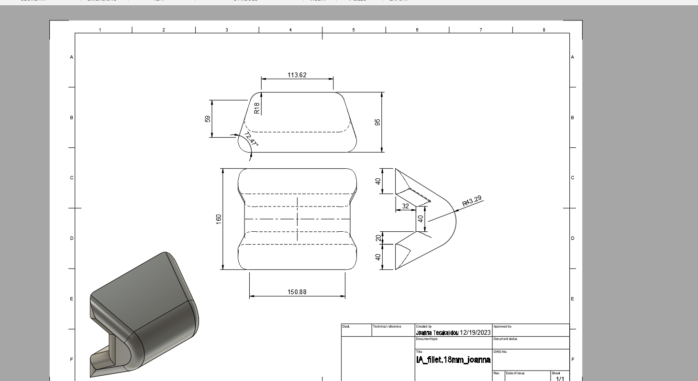
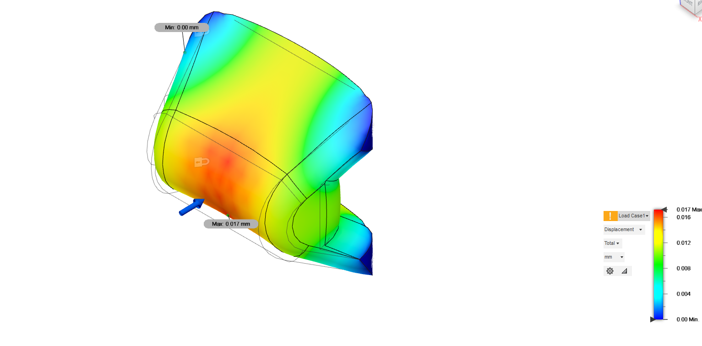
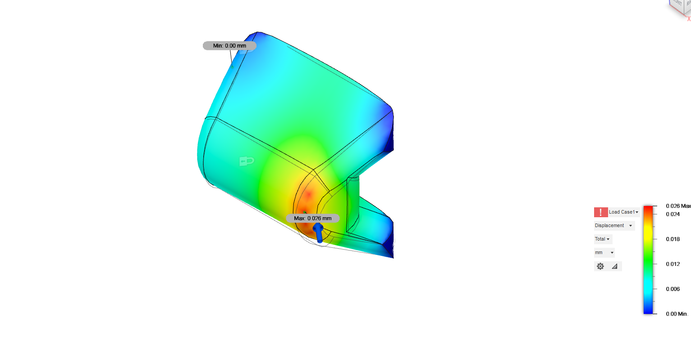
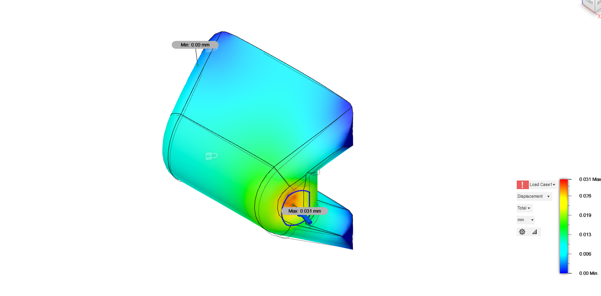
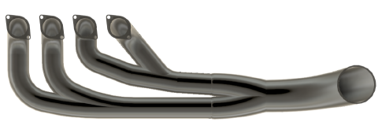
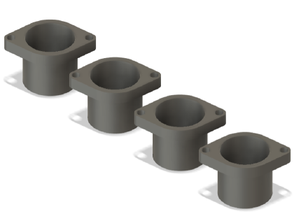

# Formula Student, D.A.R.T. Daedalus Racing Team

Ioanna Texakalidou, Powertrain and Electronics Subteam Leader, International Hellenic University, 2023 to 2025

D.A.R.T. was a newly founded Formula Student team, so my two years were spent in the vehicle design phase. I led a subteam of about 10 people working on powertrain and electronics hardware, and I also took on the impact attenuator.

## Impact attenuator (December 2023)

The impact attenuator is the crushable nose at the very front of the car that protects the driver in a frontal crash. The Formula Student 2023 rules require it to absorb at least 7,350 J when hitting a barrier at 7 m/s, while keeping the deceleration under 20 g average and 40 g peak.

I read through published IA designs and test papers and the 2023 rules, then designed a new IA shape in Fusion 360 as an alternative to the team's first concept. The version shown here has 18 mm fillets on the edges.

I ran static FEA in Fusion 360 for three load directions, frontal, diagonal and side, and checked stress, displacement, strain and safety factor for each one. The images show the displacement results.

| Frontal load | Diagonal load | Side load |
|---|---|---|
|  |  |  |

These were static checks of the structure at the design stage. The energy absorption of a real IA has to be proven with a dynamic crash test, which the team hadn't reached yet.

## Powertrain parts

Two of the powertrain parts I designed in Fusion 360 for the engine.

| 4-into-1 exhaust header | Intake runners |
|---|---|
|  |  |

## Tools

Fusion 360 (CAD, drawings, static FEA), Formula Student Rules 2023

Contact: j.texakalidou@gmail.com | [Portfolio](https://ioannatexakalidou.github.io)
